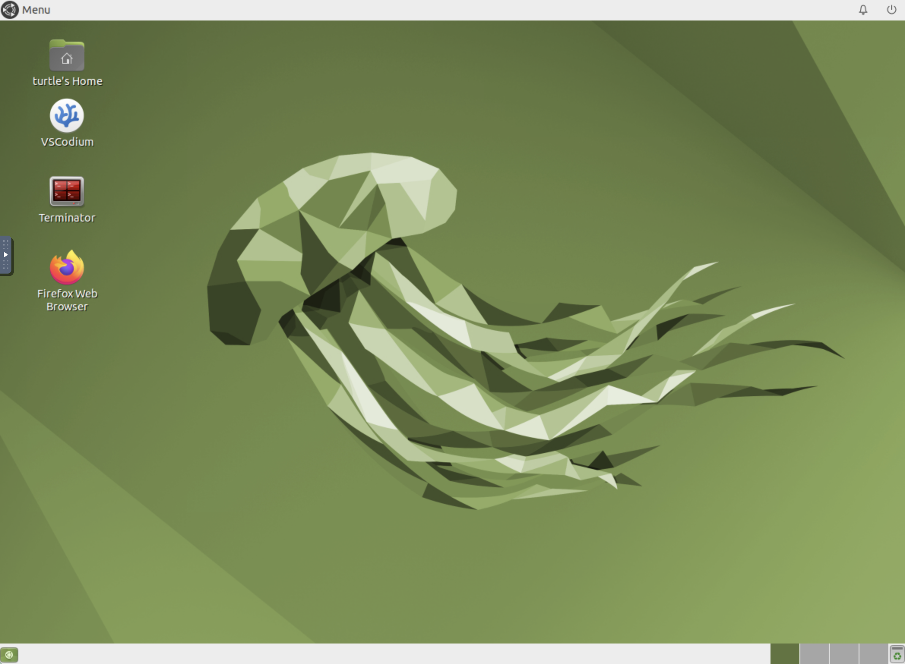

# docker-ros2-desktop-vnc
Dockerfile to provide a ROS2 container with gazebo Fortress and VNC, based on [Tiryoh/docker-ros2-desktop-vnc](https://github.com/Tiryoh/docker-ros2-desktop-vnc)

## Quick Start

Run the docker container and access with port `6080`.  
Change the `shm-size` value depending on the situation.

__NOTE__: `--security-opt seccomp=unconfined` flag is required to launch humble image. See https://github.com/Tiryoh/docker-ros2-desktop-vnc/pull/56.

An example `docker-compose.yaml` is provided, e.g.

```
services:
  ros-desktop-vnc:
    image: sylar/ros2-desktop-vnc:humble
    ## seccomp profile must be deactivated for Ubuntu 22.04
    security_opt:
      - seccomp:unconfined
    shm_size: '512m'
    restart: unless-stopped
    container_name: ros2_desktop_vnc
    hostname: remotepc
    ## To solve some issue with VNC
    extra_hosts:
      - "remotepc:127.0.0.1"
    volumes:
      - /path/to/your/ws/src:/home/turtle/ros2_ws/src
```

Browse http://127.0.0.1:6080/.



## Make the container communicate with an external host

The image also includes [`zenoh-bridge-ros2dds`](https://github.com/eclipse-zenoh/zenoh-plugin-ros2dds). It allows the container to communicate with an external host (e.g. a robot), which is not always possible even in host mode (in particular with a Windows or macos host). Note that [`zenoh-bridge-ros2dds`](https://github.com/eclipse-zenoh/zenoh-plugin-ros2dds) must also be installed on the robot.

Consider the robot has an IP address `192.168.0.10`. On the robot, launch `zenoh-bridge-ros2dds`. Then you can connect the docker container to the robot trough the zenoh bridge by typing in a terminal inside the container: `zenoh-bridge-ros2dds -e tcp/192.168.0.10:7447`. Then, both hosts (the robot and the container) will communicate together through the bridge. Note that for that purpose, as indicated in `zenoh-bridge-ros2dds` [documentation](https://github.com/eclipse-zenoh/zenoh-plugin-ros2dds?tab=readme-ov-file#usage), `ROS_LOCALHOST_ONLY` environment variable has been set to 1 to make sure that NO direct DDS communication can occur between 2 hosts that are bridged by `zenoh-bridge-ros2dds`. This can be changed in the `.bashrc` file if needed.

## SSH login with SSH key

A `id_rsa_turtlebot3.pub` file has been added to the repository to allow SSH login to some remote robot without having to type in the password. Upload it to the robot in its own `.ssh/authorized_keys` file. Note that the correspoding private key has been added to the image (in `.ssh/id_rsa_turtlebot3`), which makes it *not that much private*, so please use your own key if security is an issue. SSH config file in `.ssh/config` specifies the key to be used for hosts matching `192.168.*` IP addresses: change this setting if the IP address of the robot is not in this network.

## Build

To build Docker image from this Dockerfile, run the following command.

* humble
```sh
# using "docker buildx (multiarch)"
cd humble && docker buildx build --push --platform=linux/arm64,linux/amd64 --progress=plain -t sylar/ros2-desktop-vnc:humble .
```

## Docker tags on hub.docker.com

* [`humble`](https://hub.docker.com/r/sylar/ros2-desktop-vnc/tags?page=1&name=humble), which is based on [`humble/Dockerfile`](./humble/Dockerfile)

## Related projects

* https://github.com/atinfinity/nvidia-egl-desktop-ros2
  * Dockerfile to use ROS 2 on Xfce Desktop container with NVIDIA GPU support via VNC/[Selkies](https://github.com/selkies-project/selkies-gstreamer)(Full desktop streaming with WebRTC)
* https://github.com/fcwu/docker-ubuntu-vnc-desktop
  * Dockerfile to access Ubuntu Xfce/LXDE/LxQT desktop environment via web VNC interface
* https://github.com/AtsushiSaito/docker-ubuntu-sweb
  * Dockerfile to access Ubuntu MATE desktop environment via web VNC interface

## License

This repository is released under the Apache License 2.0, see [LICENSE](./LICENSE).  
Unless attributed otherwise, everything in this repository is under the Apache License 2.0.

### Acknowledgements

* This Dockerfile is based on [Tiryoh/docker-ros2-desktop-vnc](https://github.com/Tiryoh/docker-ros2-desktop-vnc),  licensed under the [Apache License 2.0](https://github.com/Tiryoh/docker-ros2-desktop-vnc/blob/master/LICENSE)
* This Dockerfile is based on [AtsushiSaito/docker-ubuntu-sweb](https://github.com/AtsushiSaito/docker-ubuntu-sweb), licensed under the [Apache License 2.0](https://github.com/AtsushiSaito/docker-ubuntu-sweb/blob/5e7ba8571d2f4d1e4fca0c1527d090c20f7f5e90/LICENSE).
* This Dockerfile is based on [fcwu/ubuntu-desktop-lxde-vnc](https://github.com/fcwu/docker-ubuntu-vnc-desktop), licensed under the [Apache License 2.0](https://github.com/fcwu/docker-ubuntu-vnc-desktop/blob/60f9ae18e71e9fabbfb23f67b212e64ab72c206e/LICENSE).
